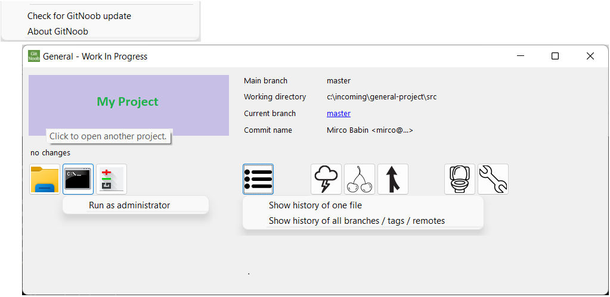
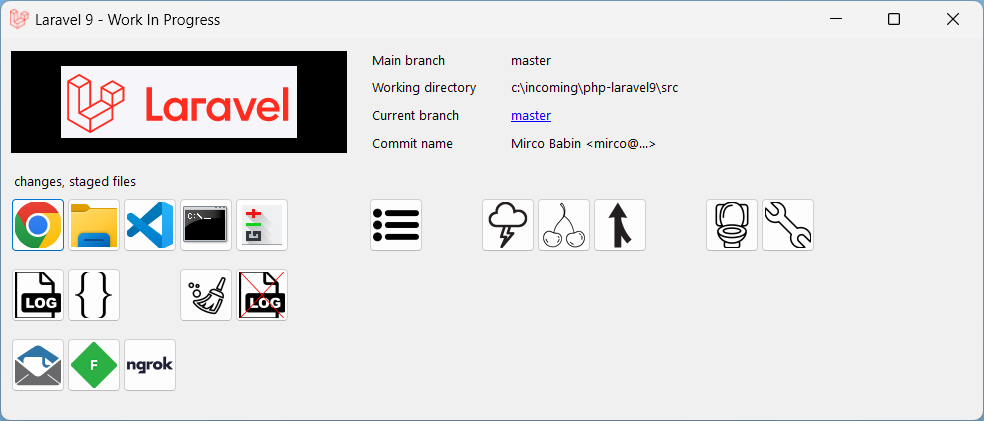

# GitNoob

**Warning: GitNoob is a very opinionated tool.**

GitNoob is a development tool for the Windows platform. The purpose is never have to touch the git commandline again. To forget all quirks of git and focus on programming.

GitNoob solves the following problems:

- Visual distinction of different projects.
- Explicitly configure the main branch name.
- Downloading the latest version from upstream. And integrating the upstream changes into the current branch.
- Merging your current branch with upstream. Without those annoying merge commits which make the git history unreadable.
- Logical locking the main branch when merging. If everyone in the team uses GitNoob, one can merge and may have to resolve conflicts only once. Because the others will not merge until this merge is finished.
- Changing branch, creating / renaming a branch. Taking into account possible working tree changes.
- Deleting a branch. With the safety first feature to also undelete the deleted branch.
- Flushing all your current changes down the toilet. To be able to start over, continue with a clean slate.
- When having committed to the wrong branch (e.g. the main branch) provide a remedy to move the commits to a new branch.
- Prevent git disaster from happening when: in detached head state, inside rebase, inside merge, inside cherry-picking, inside reverting, having working tree changes, having staged uncommitted files.
- When using [Git Credentials via KeePassCommander](https://github.com/MircoBabin/GitCredentialsViaKeePassCommander) ensure KeePass is started.
- Starting a dosprompt. Also with the "as administrator" option.
- Starting an explorer.
- Starting [Git Gui](https://github.com/prati0100/git-gui/) for committing changes.
- Starting git history for current branch, all branches or one file.
- Optional: Starting the IDE. With the ability to start with "run as administrator" privileges.
- Optional: Starting the browser. And automatically start Apache if needed.
- Optional: Starting a local smtp server like [PaperCut-SMTP](https://github.com/ChangemakerStudios/Papercut-SMTP).
- Optional: Starting [Fiddler](https://www.telerik.com/fiddler/fiddler-classic).
- Optional: Starting [Ngrok](https://ngrok.com/). And automatically start Apache if needed.

For [Php](https://www.php.net/) projects:

- Use a different php.ini and php version per project.
- Setup the correct path for global [Composer](https://getcomposer.org/) binaries (%appdata%\Composer\vendor\bin).

For [Php Laravel 7](https://laravel.com/docs/7.x), [Php Laravel 8](https://laravel.com/docs/8.x), [Php Laravel 9](https://laravel.com/docs/9.x) projects:

- Laravel is a Php project. All advantages for Php projects also apply for Laravel projects.
- Clear the Laravel cache.
- Clear the Laravel logfiles.
- Open the Laravel logfiles directory.
- Edit the .env file.
- After merging, rebuild the Laravel cache (composer dump-autoload, artisan route:cache) and commit + push to remote.

# Installation
For Windows (.NET framework 4), [the latest version can be found here](https://github.com/MircoBabin/GitNoob/releases/latest "Latest Version").

- Make sure [Git 2.34.1 or higher](https://git-scm.com/) is installed and reachable everywhere via the Windows global **path** setting.
- Download the zip and unpack it somewhere.
- Then a directory My Documents\GitNoob needs to be manually created. And manually populated with GitNoob.ini and other files. See the [documentation](docs/README.md "Documentation").

*For unattended automatic installation scripts, read the section "Automatic installation scripts" lower down the page.*

# Why
I had a bunch of bat files to automate some projects tasks. Because the bat files did not cover everything I also had a TiddlyWiki containing snippets of git commands.
As I had to work in more and more PHP projects, with each project having each own exceptions, it became harder to manage the bat files and project settings. 
And it became annoying to always have to lookup the stash and other commands, because my programming work was interrupted and I had to fix something with priority.
So I decided it was time to build a tool. That's why I started GitNoob.

# Automatic installation scripts
For unattended installation scripts the following flow can be used for the latest version:

1) Download https://github.com/MircoBabin/GitNoob/releases/latest/download/release.download.zip.url-location
2) Read the text of this file into **latest-download-url**. The file only contains an url, so the encoding is ASCII. *The encoding UTF-8 may also be used to read the file, because ASCII is UTF-8 encoding.*
3) Download the zip from the **latest-download-url** to local file **GitNoob.zip**. *Each release carries the version number in the filename. To prevent not knowing the downloaded filename, download to a fixed local filename.*
4) Unpack the downloaded **GitNoob.zip** into a directory of your choice. Optionally create a Windows desktop shortcut to GitNoob.exe.

# Contributions
**Warning: GitNoob is a very opinionated tool.**

Contributions are welcome. Please read [CONTRIBUTING.md](CONTRIBUTING.md "contributing") before making any contribution!

# License
[The license is MIT.](LICENSE.md "license")

